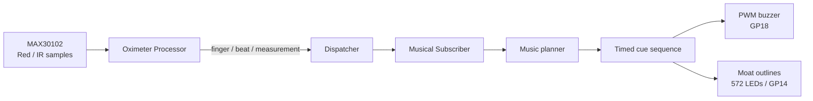

# 生体パルスをPWMメロディーに変換する仕組み

[English](biometric_pwm_music.md)

## 1. 目的

この作品は、MAX30102で取得した指先の脈波を、その場でPWMブザーのメロディーと大仙古墳模型の光へ変換する。録音済みの曲を再生するのではなく、現在の拍間隔、SpO₂の変化、光学脈波の幅を音高・音価・音色へ割り当てるため、身体の状態が演奏内容に直接現れる。

PWMでは周波数が音高を、duty比が1周期中にブザーを駆動する時間を決める。本実装は、心拍の周期を音高とリズムへ、脈波の形をduty比へ対応させ、センサーの「パルス」とPWMの「パルス幅」を結び付けている。

> 心拍数とSpO₂は演出用の推定値である。この作品を診断、治療判断、安全監視には使用しない。

## 2. 全体構成



音と光は別々に生体データを解釈しない。音楽プランナーが作った同一のキュー列を`Musical::Outputs::KofunCanon`と`MoatCanon`が参照する。各キューには開始・終了時刻、周波数、発音時間、PWM duty、対象の濠が含まれるため、音と濠の輪郭LEDが同じスケジュールで動く。

| mrbgem | 役割 |
| --- | --- |
| `daisenkofun-oximeter` | 指、拍、拍間隔、脈波形、BPM、SpO₂を求めてイベントを発行する |
| `daisenkofun-musical` | イベントを音高・音価・duty・発音時刻を持つキューへ変換し、PWMを駆動する |
| `daisenkofun-illumination` | 音楽キューが示す内濠・中濠・外濠の輪郭を描画する |
| `daisenkofun-application` | コンポーネントを接続し、イベントループ、終了処理、検証要約を管理する |
| `main.rb` | `Application::Config`を宣言し、`Application::Runner`を起動する |

## 3. MAX30102から音楽イベントまで

`Oximeter::Measurement::Processor`はMAX30102のRed値とIR値を順次処理する。指を検出した後、IR波形から有効な拍を検出すると`:beat`を発行し、十分なサンプルがそろうと`:measurement_updated`も発行する。

| イベント | 主な値 | 音楽側の動作 |
| --- | --- | --- |
| `finger_detected` | `timestamp_ms`, `ir` | 古い予約音と変換状態を初期化して測定を開始する |
| `beat` | `interval_ms`, `timestamp_ms`, `pulse_width_ratio`など | 新しい音楽キューを生成する |
| `measurement_updated` | `bpm`, `spo2`, `timestamp_ms` | SpO₂の基準値、傾き、音程方向を更新する |
| `finger_removed` | `timestamp_ms`, `ir` | 消音し、予約音、SpO₂基準、脈波形、収集中の署名を破棄する |

`PulseShapeExtractor`は連続する拍の間に集めたIRサンプルから波形特徴を抽出する。最小値から振幅の半分までの低い区間をパルス幅として数え、次の値を作る。

```text
pulse_width_ratio = half-height区間のサンプル数 / 1拍のサンプル数
pulse_width_ms    = interval_ms × pulse_width_ratio
```

最初の区間、8サンプル未満、または振幅不足の区間では、信頼できない値を音色へ使わない。

## 4. 生体値と音の対応

### 音高

拍間隔から基準周波数を求め、Cメジャー・ペンタトニックの最も近い音へ丸める。

```text
frequency_hz = 256000 / interval_ms
```

使用音域は131〜880 Hzである。たとえば800 msの拍間隔は320 Hzとなり、近い330 Hzへ量子化される。通常のパルス変換では、近接する音を細かく往復しないようヒステリシスも使う。

### PWM dutyと音色

正規化した脈波幅を2〜6%のPWM dutyへ線形変換する。

```text
duty_percent = 2.0 + 4.0 × pulse_width_ratio
```

| `pulse_width_ratio` | PWM duty |
| ---: | ---: |
| 0.00 | 2.0% |
| 0.25 | 3.0% |
| 0.50 | 4.0% |
| 1.00 | 6.0% |

周波数が同じでもdutyが変わると倍音成分が変わり、ブザーの音色が変化する。脈波幅が取得できない拍では3%を使う。

### SpO₂の変化

通常のパルス変換と古墳の輪唱では、最初の8回の有効なSpO₂更新の中央値を個人基準とする。以後の値は平滑化し、基準との差が+0.5より大きければ音階を上方向、-0.5より小さければ下方向へ動かす。5秒より古い値は使わない。

## 5. 3つの演奏方式

| `musical_style` | 構成 | 生体データの反映 |
| --- | --- | --- |
| `:pulse_translation` | 心拍時の主音と半拍後の応答音 | 拍間隔を主音、SpO₂を応答音の上下、脈波幅をdutyへ変換 |
| `:kofun_canon` | 1拍から三重濠を巡る3音の輪唱 | 拍間隔を主音と巡回方向、SpO₂を基本順、脈波幅をdutyへ変換 |
| `:heartbeat_signature` | 7拍は輪唱、8拍目は8音の固有フレーズ | 8拍分の拍間隔、SpO₂、脈波幅を音高・音価・dutyへ変換 |

### 古墳の輪唱

`Musical::Planners::KofunCanon`は1拍を3分割し、内濠・中濠・外濠に対応する3音を予約する。各声は基準音から五音音階で0段、2段、4段離し、dutyには+0.4、0、-0.4ポイントの差を加える。

前拍より40 ms以上短い拍では内から外へ進む方向、40 ms以上長い拍では外から内へ戻る方向を選ぶ。SpO₂の方向は4拍ごとに基本の濠順へ反映される。実際の濠部分にはLEDがないため、模型では各濠を挟む輪郭LEDを点灯する。

### 8拍から作る「心拍の署名」

`Musical::Planners::HeartbeatSignature`は連続する8拍を一組として保存する。最初の7拍では古墳の輪唱を続け、8拍目が届くと8音の署名フレーズへ置き換える。

各音は対応する1拍から次の規則で作られる。

1. 拍間隔を`256000 / interval_ms`で五音音階へ量子化する。
2. 直前の拍より40 ms以上短ければ1段上げ、40 ms以上長ければ1段下げる。
3. 1拍目のSpO₂との差が+0.5を超えればさらに1段上げ、-0.5未満なら1段下げる。
4. 音価を`interval_ms / 12`とし、45〜90 msに収める。
5. 脈波幅を2〜6%のPWM dutyへ変換する。
6. 8音を8拍目の拍間隔内へ等間隔で配置し、LEDを内濠、中濠、外濠の順に巡回する。

入力と規則が同じなら必ず同じ8音になる。乱数を使わないため、同じ固定入力から音高、音価、duty、濠順を再現できる。署名の再生後は次の拍から輪唱へ戻り、次の8拍を収集する。

## 6. リアルタイム実行とLED転送

イベントループはOximeterのサンプルを先に読み、その後に音楽とイルミネーションを`tick`する。音楽購読者をLED購読者より先に登録し、プランナーがキューを公開してからLED側が参照する。同じキューではPWMを開始してから572個のLEDフレームを転送する。

`MoatCanon`は50 ms間隔でキューを確認し、表示する濠または明るさが変化した場合だけフレームを更新する。ピクセルの消去と濠インデックスの差分描画をmruby/c側で行い、`Display#show`はCメソッド`_write_pixels`でパック済みの572ピクセルをWS2812ドライバへ一括コピーしてから1回だけ`show`する。これによりRubyから1ピクセルずつ更新する処理を避け、発音開始の遅延を抑える。

## 7. 実行と確認

[`main.rb`](../main.rb)を次のように設定する。

```ruby
config = Daisenkofun::Application::Config.new(
  mode: :combined,
  duration_ms: 60_000,
  buzzer_pin: 18,
  musical_style: :heartbeat_signature
)
```

```sh
rpremote run examples/picoruby/projects/daisenkofun/main.rb --timeout 90
```

`source=canon`は通常の輪唱、`source=heartbeat_signature`は8音の署名を表す。終了時には次の形式で演奏キュー数、最大開始遅延、生成した署名数を確認できる。

```text
DAISENKOFUN mode=combined component=musical event=verification status=ok cues=... max_delay_ms=... signatures=...
```

実機では、8拍収集後に8音が鳴ること、次の拍で輪唱へ戻ること、対応する濠の輪郭LEDが同期すること、指の離脱と再検出後に新しい8拍を収集すること、`max_delay_ms`が25 ms以下であることを確認する。

この一連の動作は、mrbgemのCoCリファクタリング後にPico 2実機で確認済みである。センサー閾値、キューのスケジュール、LED転送、PWM出力、PicoRubyファームウェアを変更した場合は再確認する。

## 8. 実装の参照先

- Oximeterデバイスのライフサイクル: [`device.rb`](../mrbgems/daisenkofun-oximeter/mrblib/daisenkofun-oximeter/device.rb)
- Oximeterイベント生成: [`measurement/processor.rb`](../mrbgems/daisenkofun-oximeter/mrblib/daisenkofun-oximeter/measurement/processor.rb)
- 脈波幅の抽出: [`pulse_shape_extractor.rb`](../mrbgems/daisenkofun-oximeter/mrblib/daisenkofun-oximeter/measurement/pulse_shape_extractor.rb)
- 拍間隔とSpO₂の音高変換: [`pulse.rb`](../mrbgems/daisenkofun-musical/mrblib/daisenkofun-musical/translators/pulse.rb)
- 脈波幅のduty変換: [`timbre.rb`](../mrbgems/daisenkofun-musical/mrblib/daisenkofun-musical/translators/timbre.rb)
- 古墳の輪唱: [`kofun_canon.rb`](../mrbgems/daisenkofun-musical/mrblib/daisenkofun-musical/planners/kofun_canon.rb)
- 心拍の署名: [`heartbeat_signature.rb`](../mrbgems/daisenkofun-musical/mrblib/daisenkofun-musical/planners/heartbeat_signature.rb)
- パルス変換のPWM出力: [`outputs/pwm.rb`](../mrbgems/daisenkofun-musical/mrblib/daisenkofun-musical/outputs/pwm.rb)
- 古墳の輪唱・心拍の署名のPWM出力: [`outputs/kofun_canon.rb`](../mrbgems/daisenkofun-musical/mrblib/daisenkofun-musical/outputs/kofun_canon.rb)
- 濠LED同期: [`moat_canon.rb`](../mrbgems/daisenkofun-illumination/mrblib/daisenkofun-illumination/biometrics/moat_canon.rb)
