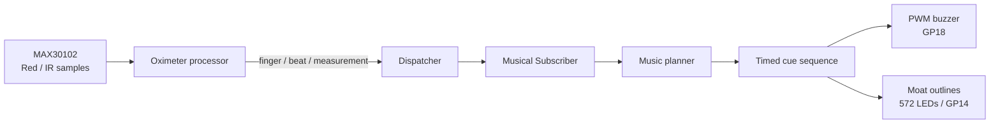

# Biometric pulse to PWM melody

[日本語](biometric_pwm_music.ja.md)

## 1. Purpose

This installation turns fingertip pulse waves captured by a MAX30102 into live PWM-buzzer melodies and light on the Daisen Kofun model. It does not play a prerecorded song. Instead, the current beat interval, SpO₂ movement, and optical pulse width directly shape pitch, note length, and timbre.

With PWM, frequency determines pitch and duty cycle determines how long the buzzer is driven during each period. This implementation maps the heartbeat period to pitch and rhythm, and the pulse-wave shape to duty cycle, linking the sensor's biological pulse to PWM pulse width.

> Heart rate and SpO₂ are estimates for learning and presentation effects. Do not use this installation for diagnosis, treatment decisions, or safety monitoring.

## 2. Architecture



Sound and light do not interpret the biometric data independently. `Musical::Outputs::KofunCanon` and `MoatCanon` consume the same cue sequence created by the music planner. Each cue contains its start and end times, frequency, note length, PWM duty, and target moat, so the sound and moat-outline LEDs follow one schedule.

| mrbgem | Responsibility |
| --- | --- |
| `daisenkofun-oximeter` | Detect the finger and beats, derive beat interval and pulse shape, estimate BPM and SpO₂, and publish events. |
| `daisenkofun-musical` | Turn events into timed pitch, duration, duty, and moat cues, then drive PWM. |
| `daisenkofun-illumination` | Render the inner-, middle-, and outer-moat outlines selected by music cues. |
| `daisenkofun-application` | Connect the components and manage the event loop, cleanup, and verification summary. |
| `main.rb` | Declare `Application::Config` and start `Application::Runner`. |

## 3. From MAX30102 samples to music events

`Oximeter::Measurement::Processor` processes the MAX30102 red and IR values in order. After detecting a finger, it publishes `:beat` when it finds a valid beat in the IR waveform and also publishes `:measurement_updated` once enough samples are available.

| Event | Main values | Musical behavior |
| --- | --- | --- |
| `finger_detected` | `timestamp_ms`, `ir` | Clear stale scheduled notes and conversion state, then begin measurement. |
| `beat` | `interval_ms`, `timestamp_ms`, `pulse_width_ratio`, and related values | Generate new music cues. |
| `measurement_updated` | `bpm`, `spo2`, `timestamp_ms` | Update the SpO₂ baseline, trend, and pitch direction. |
| `finger_removed` | `timestamp_ms`, `ir` | Mute, then discard scheduled notes, the SpO₂ baseline, pulse-shape state, and a partial signature. |

`PulseShapeExtractor` derives waveform features from the IR samples collected between consecutive beats. It counts the contiguous low region around the minimum up to half of the amplitude and calculates:

```text
pulse_width_ratio = samples in the half-height region / samples in one beat
pulse_width_ms    = interval_ms × pulse_width_ratio
```

The first interval, an interval with fewer than eight samples, or one with insufficient amplitude does not supply a timbre value.

## 4. Mapping biometric values to sound

### Pitch

The beat interval produces a base frequency, which is quantized to the nearest note in a C major pentatonic scale:

```text
frequency_hz = 256000 / interval_ms
```

The available range is 131–880 Hz. For example, an 800 ms interval produces 320 Hz and is quantized to the nearby 330 Hz note. The normal pulse-translation style also uses hysteresis to avoid rapidly alternating between adjacent notes.

### PWM duty and timbre

The normalized pulse width maps linearly to 2–6% PWM duty:

```text
duty_percent = 2.0 + 4.0 × pulse_width_ratio
```

| `pulse_width_ratio` | PWM duty |
| ---: | ---: |
| 0.00 | 2.0% |
| 0.25 | 3.0% |
| 0.50 | 4.0% |
| 1.00 | 6.0% |

Changing duty alters the buzzer's harmonic content and timbre even when the frequency is unchanged. A beat without a usable pulse width falls back to 3%.

### SpO₂ movement

For pulse translation and the kofun canon, the median of the first eight valid SpO₂ updates becomes the personal baseline. Later readings are smoothed. A difference greater than +0.5 moves the scale upward, and a difference less than -0.5 moves it downward. A reading older than five seconds is not used.

## 5. Three musical styles

| `musical_style` | Structure | Biometric mapping |
| --- | --- | --- |
| `:pulse_translation` | A main note on the beat and a response half a beat later. | Interval selects the main note, SpO₂ selects response direction, and pulse width selects duty. |
| `:kofun_canon` | Three sequential voices travel around the three moats. | Interval selects the main note and travel direction, SpO₂ selects the base route, and pulse width selects duty. |
| `:heartbeat_signature` | Seven canon beats followed by a personal eight-note phrase on beat eight. | Eight intervals, SpO₂ values, and pulse widths determine pitch, duration, and duty. |

### Kofun canon

`Musical::Planners::KofunCanon` divides one beat into thirds and schedules three notes for the inner, middle, and outer moats. The voices are separated from the base note by 0, 2, and 4 pentatonic steps and add +0.4, 0, and -0.4 percentage points to duty.

An interval at least 40 ms shorter than the previous one selects forward travel; one at least 40 ms longer selects reverse travel. SpO₂ direction changes the base moat order at four-beat phrase boundaries. Because the physical moats contain no LEDs, the model lights the outline LEDs bordering each moat.

### An eight-beat heartbeat signature

`Musical::Planners::HeartbeatSignature` saves each group of eight consecutive beats. It continues the kofun canon for the first seven beats, then replaces the eighth beat's canon with an eight-note signature phrase.

Each note is derived from its corresponding beat:

1. Quantize `256000 / interval_ms` to the pentatonic scale.
2. Raise it one step when the interval is at least 40 ms shorter than the previous beat, or lower it one step when the interval is at least 40 ms longer.
3. Raise it another step when SpO₂ is more than 0.5 above the first beat, or lower it when SpO₂ is more than 0.5 below.
4. Set the note length to `interval_ms / 12`, clamped to 45–90 ms.
5. Map pulse width to 2–6% PWM duty.
6. Space all eight notes evenly inside the eighth beat interval and cycle the LEDs through the inner, middle, and outer moats.

The same input and rules always produce the same eight notes; no randomness is used. After the signature finishes, the next beat returns to the canon and starts collecting the next group of eight.

## 6. Real-time execution and LED transfer

Each event-loop tick reads Oximeter samples before ticking the music and illumination components. The musical subscriber is registered before the LED subscriber so the planner publishes cues before the LEDs read them. For a shared cue, PWM starts before the 572-pixel LED frame is transferred.

`MoatCanon` checks cues every 50 ms and updates the frame only when the visible moat or brightness changes. Pixel clearing and indexed moat fills run on the mruby/c side. `Display#show` uses the C method `_write_pixels` to copy all 572 packed pixels into the WS2812 driver before calling `show` once. This avoids updating each pixel from Ruby and reduces tone-start delay.

## 7. Run and verify

Configure [`main.rb`](../main.rb) as follows:

```ruby
config = Daisenkofun::Application::Config.new(
  mode: :combined,
  duration_ms: 60_000,
  buzzer_pin: 18,
  musical_style: :heartbeat_signature
)
```

Then run:

```sh
rpremote run examples/picoruby/projects/daisenkofun/main.rb --timeout 90
```

`source=canon` identifies normal canon cues, while `source=heartbeat_signature` identifies the eight signature notes. At the end, the application reports the played cue count, maximum start delay, and generated signature count:

```text
DAISENKOFUN mode=combined component=musical event=verification status=ok cues=... max_delay_ms=... signatures=...
```

On the device, confirm that eight notes play after eight beats, the canon returns on the next beat, the corresponding moat-outline LEDs stay synchronized, removing and replacing the finger starts a fresh eight-beat collection, and `max_delay_ms` is no greater than 25 ms.

This end-to-end flow has been verified on physical Pico 2 hardware after the mrbgem CoC refactoring. Repeat the check after changing sensor thresholds, cue scheduling, LED transfer, PWM output, or the PicoRuby firmware.

## 8. Implementation reference

- Oximeter device lifecycle: [`device.rb`](../mrbgems/daisenkofun-oximeter/mrblib/daisenkofun-oximeter/device.rb)
- Oximeter event generation: [`measurement/processor.rb`](../mrbgems/daisenkofun-oximeter/mrblib/daisenkofun-oximeter/measurement/processor.rb)
- Pulse-width extraction: [`pulse_shape_extractor.rb`](../mrbgems/daisenkofun-oximeter/mrblib/daisenkofun-oximeter/measurement/pulse_shape_extractor.rb)
- Beat interval and SpO₂ pitch mapping: [`pulse.rb`](../mrbgems/daisenkofun-musical/mrblib/daisenkofun-musical/translators/pulse.rb)
- Pulse-width duty mapping: [`timbre.rb`](../mrbgems/daisenkofun-musical/mrblib/daisenkofun-musical/translators/timbre.rb)
- Kofun canon: [`kofun_canon.rb`](../mrbgems/daisenkofun-musical/mrblib/daisenkofun-musical/planners/kofun_canon.rb)
- Heartbeat signature: [`heartbeat_signature.rb`](../mrbgems/daisenkofun-musical/mrblib/daisenkofun-musical/planners/heartbeat_signature.rb)
- Pulse-translation PWM output: [`outputs/pwm.rb`](../mrbgems/daisenkofun-musical/mrblib/daisenkofun-musical/outputs/pwm.rb)
- Canon and heartbeat-signature PWM output: [`outputs/kofun_canon.rb`](../mrbgems/daisenkofun-musical/mrblib/daisenkofun-musical/outputs/kofun_canon.rb)
- Moat LED synchronization: [`moat_canon.rb`](../mrbgems/daisenkofun-illumination/mrblib/daisenkofun-illumination/biometrics/moat_canon.rb)
